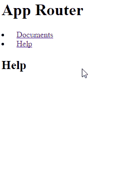

# Reproduce

1. Click on `Documents`
2. Click on `Link`
3. Click on `Broken Edit` and notice how it navigates to edit. 
4. Click on `Broken Details` and notice how it navigates to details.
5. Reload the page.
6. Click `Broken Edit`, it shouldn't navigate away from `Edit`. 
7. Click `Edit`
8. Click on `Broken Details`, it shouldn't navigate to details either. 

The log says that the route was not found.

        aurelia.js:14793 ERROR [app-router] Error: Route not found: /details
            at AppRouter._createNavigationInstruction (https://jdanyow.github.io/rjs-bundle/bundles/aurelia.js:16353:29)
            at AppRouter.loadUrl (https://jdanyow.github.io/rjs-bundle/bundles/aurelia.js:16948:19)
            at BrowserHistory._loadUrl (https://jdanyow.github.io/rjs-bundle/bundles/aurelia.js:14456:55)
            at BrowserHistory._checkUrl (https://jdanyow.github.io/rjs-bundle/bundles/aurelia.js:14449:14)error @ aurelia.js:14793
        aurelia.js:14793 ERROR [app-router] Error: Route not found: /edit
            at AppRouter._createNavigationInstruction (https://jdanyow.github.io/rjs-bundle/bundles/aurelia.js:16353:29)
            at AppRouter.loadUrl (https://jdanyow.github.io/rjs-bundle/bundles/aurelia.js:16948:19)
            at BrowserHistory._loadUrl (https://jdanyow.github.io/rjs-bundle/bundles/aurelia.js:14456:55)
            at BrowserHistory._checkUrl (https://jdanyow.github.io/rjs-bundle/bundles/aurelia.js:14449:14)

# Video

